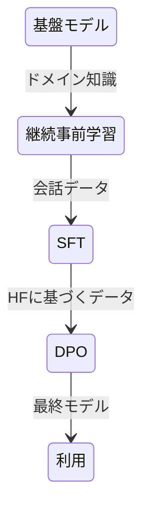

# llm-training-sample

## 概要

軽量モデルを利用した LLM のローカル実行のサンプルリポジトリです。以下のリポジトリを参考に実装しています。

- https://github.com/SO0529/2601_software-design-chap3/tree/main

## 実行環境

Google Colab の GPU 環境を利用することを想定しています。

VSCode に以下の拡張機能を入れることで、ローカルのソースコードを Colab のランタイムで実行できます。

- google.colab

## 利用している基盤モデル

このリポジトリでは、**SmolLM2-360M** と **Qwen3-0.6B** という 2 つの軽量言語モデルを基盤モデルとして利用しています。

### 概要比較

| 項目         | SmolLM2-360M         | Qwen3-0.6B           |
| ------------ | -------------------- | -------------------- |
| 提供元       | HuggingFaceTB        | Alibaba Cloud / Qwen |
| パラメータ数 | ~360M                | ~600M                |
| 重点領域     | 軽量実行・低リソース | 応答品質・多言語     |
| 用途         | エッジ/オンデバイス  | 汎用テキスト生成     |

## LLM の利用までの流れ

基盤モデルから独自モデルを作成し、利用するまでの流れは以下の通りです。

それぞれのフェーズについて、以下のノートブックで実装例を示しています。

- `src/03-continued-pre-training.ipynb` 継続事前学習
- `src/04-supervised-fine-tuning.ipynb` SFT
- `src/05-direct-preference-optimization.ipynb` DPO
- `src/01-transformer-chat-completion.ipynb` 利用 (Transformers)
- `src/02-vllm-chat-completion.ipynb` 利用 (vLLM)

### 参考リンク

- Hugging Face: SmolLM2-360M — https://huggingface.co/HuggingFaceTB/SmolLM2-360M :contentReference[oaicite:8]{index=8}
- Hugging Face: Qwen3-0.6B — https://huggingface.co/Qwen/Qwen3-0.6B :contentReference[oaicite:9]{index=9}
